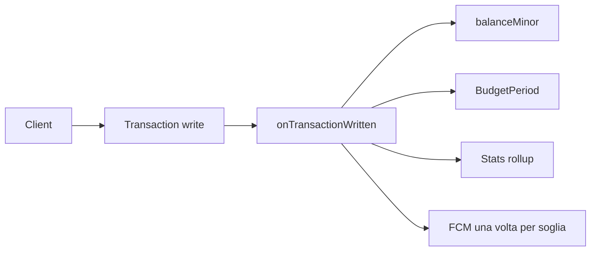

# Family Finance: piano di sviluppo

Spec di partenza: l’ultima versione del piano di intervento. Questo documento la rende implementabile e chiude i buchi che bloccherebbero schema, rules e Cloud Functions.

**Stato repo oggi:** scaffold Flutter standard (`family_finance`, counter demo) in root con target Android/Web/Linux/Windows. Nessun Git, nessun Firebase, nessuna l10n, nessuna `functions/`. Non serve `flutter create`: si evolve il progetto esistente e si aggiungono Functions e config Firebase accanto.

## Decisioni fissate

- **Lingue:** inglese (template ARB) e italiano, da subito, con `flutter gen-l10n`. Nessuna stringa utente hardcoded. Locale di sistema al primo avvio se `en` o `it`, altrimenti inglese. Cambio lingua in Impostazioni, persistito con `shared_preferences`. Date e importi con `intl` sul locale UI; valuta = quella della famiglia.
- **Categorie di sistema:** in Firestore hanno `nameKey` (`categoryFood`, …) tradotta dagli ARB. Categorie utente: `name` libero, uguale in entrambe le lingue.
- **Libro mastro condiviso:** ogni membro crea, modifica e cancella transazioni. Non è un diario personale dell’autore.
- **Importo:** un solo intero `amountMinor` sempre positivo (centesimi). Niente `double`, niente `signedAmount`. Il `type` decide l’effetto sul saldo.
- **Transazioni sempre confermate.** La bozza esiste solo come `Ingestion`. L’inserimento manuale nasce già confermato. L’ingest da notifica (e OCR) crea sempre una bozza; la transazione reale nasce solo dopo conferma esplicita dell’utente — mai create silenziosa sul ledger.
- **Obiettivo virtuale:** versare sull’obiettivo non altera il saldo del conto. I versamenti sono una subcollection; il saldo conto resta la somma dei movimenti reali.
- **Sviluppo locale:** Firebase Emulator Suite con project id `demo-family-finance`, senza credenziali. `firebase_options.dart` scritto a mano per l’emulatore; `flutterfire configure` resta un passo documentato, non un blocco.
- **UI:** Material 3, navigation rail su web largo e bottom navigation su mobile. Testi reali, stati vuoto / caricamento / errore su ogni schermata dati.
- **Functions:** TypeScript. Il client non scrive mai campi derivati.

## Convenzione sui movimenti

`bookingDate` è una stringa `YYYY-MM-DD` scelta dall’utente (giorno contabile). Periodo di budget e rollup usano quel giorno, non l’istante UTC. `createdAt` resta un timestamp.

Effetto sul saldo del conto (solo transazioni confermate):

- `expense` e gamba `transfer` source: sottraggono
- `income`, `refund` e gamba `transfer` destination: sommano
- versamento o prelievo da un obiettivo: non toccano il saldo

Effetto sul periodo di budget della categoria (solo se categoria `expense`): spese sommano, rimborsi sottraggono, transfer e entrate no.

Un transfer = due documenti con lo stesso `transferId`, `categoryId` assente, ruoli `source` e `destination`. Si creano e si cancellano insieme, via callable.

Formula saldo: `openingBalanceMinor` + somma algebrica dei movimenti del conto. Se l’admin corregge il saldo iniziale, la function applica solo il delta tra vecchio e nuovo opening, senza rileggere lo storico.

## Modello Firestore

- `families/{familyId}` — `name`, `currency` (immutabile), `timezone` (IANA), `ownerId`, `status`, `createdAt`. Update nome/timezone solo admin.
- `families/{familyId}/members/{userId}` — `role`, `displayName`, `joinedAt`. Scrittura solo Admin SDK.
- `families/{familyId}/accounts/{accountId}` — `name`, `type` (`cash | bankAccount | card | wallet`), `openingBalanceMinor`, `openingDate`, `balanceMinor` (solo function), `archived`, `createdByUserId`. Vietato il delete.
- `families/{familyId}/categories/{categoryId}` — `nameKey` oppure `name`, `type` (`expense | income`, immutabile), `icon`, `color`, `archived`. Vietato il delete. `createFamily` semina le categorie di sistema.
- `families/{familyId}/transactions/{transactionId}` — `type`, `accountId`, `categoryId` (null sul transfer), `amountMinor`, `currency` (copia famiglia, immutabile), `bookingDate`, `merchant`, `note`, `transferId`, `transferRole`, `createdByUserId`, `createdAt`, `updatedAt`.
- `families/{familyId}/budgets/{budgetId}` — `categoryId` (immutabile), `limitAmountMinor`.
- `families/{familyId}/budgets/{budgetId}/periods/{yyyy-MM}` — `spentAmountMinor`, `threshold80Notified`, `threshold100Notified`. Solo function.
- `families/{familyId}/goals/{goalId}` — `name`, `targetAmountMinor`, `accumulatedAmountMinor` (solo function), `dueDate`. Nessuna categoria.
- `families/{familyId}/goals/{goalId}/contributions/{contributionId}` — `amountMinor` (positivo = versamento, negativo = prelievo), `bookingDate`, `createdByUserId`. Client crea; function aggiorna l’accumulato.
- `invites/{inviteId}` — top-level: `familyId`, `invitedEmail` (minuscolo), `invitedByUserId`, `token`, `status`, `expiresAt`, `createdAt`.
- `users/{userId}` — `email`, `displayName`, `familyId` (solo function). Client scrive il proprio profilo escluso `familyId`.
- `users/{userId}/devices/{deviceId}` — token FCM, piattaforma, `updatedAt`.
- `families/{familyId}/stats/{yyyy-MM}` — totali per categoria e per conto, entrate e spese separate, transfer esclusi. Solo function.
- `families/{familyId}/_projections/{transactionId}` — ultima immagine applicata, solo function. Idempotenza su retry (annulla precedente, applica nuovo; se coincide, no-op).
- `families/{familyId}/merchantRules/{merchantKey}` e `families/{familyId}/accountBindings/{bindingId}` — previste ora nelle rules, usate da OCR e notifiche.

**Ingestion** (`source`, draft tipizzato con `amountMinor`, `merchant`, `bookingDate`, `accountId`, `categoryId`, `status`: `needsReview | possibleDuplicate | confirmed | discarded`) usa `dedupKey` come id documento. Un possibile duplicato resta in coda fino a conferma o scarto. Alla creazione della bozza da notifica l’utente viene avvisato (FCM / locale; aggregare “N bozze da confermare” se rumoroso; sopprimere se l’app è già aperta sulla coda). Conferma → transazione reale; scarto → `discarded`. Testo grezzo notifica e foto scontrino non si salvano.

## Rules e callable

Le rules coprono anche le collection OCR/notifiche fin dalla fase 1. Test con `@firebase/rules-unit-testing` sull’emulatore.

Casi minimi rules: create account senza toccare `balanceMinor` (create/update spezzati, niente `diff()` in create), member non scrive i periodi, admin legge gli inviti della propria famiglia, invitato legge solo i propri, `currency` famiglia immutabile, categoria non cambia `type`.

Callable (Admin SDK), unica porta per la membership:

- `createFamily` — famiglia, member owner, `users.familyId`, categorie di sistema
- `createInvite`, `revokeInvite`, `acceptInvite`
- `removeMember`, `updateMemberRole`, `transferOwnership`, `leaveFamily`
- `createTransfer`, `deleteTransfer`

`acceptInvite` richiede email autenticata = `invitedEmail`, `email_verified`, token valido, `expiresAt` futuro. Se unico admin della famiglia di partenza, rifiuta finché non promuove un altro. Se unico membro, marca famiglia `orphaned`. Email diversa: nessun match (collegare account Auth o reinvito). Scadenza valutata nella callable, senza cron.

Create/update/delete transazione e update `openingBalanceMinor` passano da trigger. La function, in transazione Firestore via `_projections`:

- aggiorna `balanceMinor` dei conti coinvolti (entrambe le gambe di un transfer)
- aggiorna `BudgetPeriod` se categoria spesa
- aggiorna `stats/{yyyy-MM}`
- su superamento 80% e 100% invia FCM una sola volta per soglia a tutti i device dei membri

Stessa logica (più piccola) sul trigger contributions per `accumulatedAmountMinor`.



## App Flutter

Struttura target (partendo dallo scaffold esistente in [`lib/`](lib/), [`pubspec.yaml`](pubspec.yaml)):

```text
lib/
  l10n/app_en.arb
  l10n/app_it.arb
  core/di, router, errors, theme, locale, money
  features/auth, family, accounts, categories, transactions,
           budgets, goals, dashboard, receipt_ocr, notification_ingest
  shared/
functions/src  (TypeScript)
firestore.rules
firestore.indexes.json
firebase.json
l10n.yaml
```

`l10n.yaml`: `arb-dir: lib/l10n`, `template-arb-file: app_en.arb`, `output-localization-file: app_localizations.dart`. `pubspec.yaml` con `flutter: generate: true`, `flutter_localizations` e `intl`. `MaterialApp` usa `AppLocalizations.localizationsDelegates` e `supportedLocales`.

Architettura: Clean Architecture per feature, entità immutabili, repository astratti, DTO Firestore solo in `data`, `ChangeNotifier` + `Provider`, `go_router`. Moduli Android (listener, ML Kit) espongono interfaccia nel domain e implementazione no-op su web: niente `kIsWeb` sparso nelle schermate. Su web la cattura è assente; la coda `Ingestion` si revisiona lo stesso.

Gate del router: non autenticato → email non verificata → autenticato senza famiglia → deep link invito → shell app.

`Money` nel domain: parse input secondo locale (`1.234,56` / `1,234.56`) → `amountMinor`, e format inverso. Test unitari su entrambi i locale.

## Ordine di implementazione

Fasi 1–4 + dashboard sui rollup = primo prodotto usabile. OCR e notifiche dopo, sul modello stabile. Cancellazione account, export e privacy prima di qualsiasi pubblicazione.

### 1. Fondamenta

- Evolvere lo scaffold: tema Material 3, rimuovere counter demo
- Firebase Emulator Suite (Auth, Firestore, Functions), project id `demo-family-finance`
- l10n en/it + schermata Impostazioni cambio lingua
- Router vuoto (`go_router`), DI base, `Money`
- `firestore.rules` + test rules, `functions/` TypeScript scaffold
- README: avvio emulatori, `flutter run -d chrome`, collegare progetto Firebase reale

### 2. Auth e famiglia

- Email/password (registrazione, verifica, reset) e Google Sign-In
- Callable membership + UI bilingue
- Deep link invito in-app; in emulatore UI admin mostra/copia link
- Gate router completo

### 3. Conti, categorie, transazioni, transfer

- CRUD con archiviazione, filtri (conto / categoria / membro / date), paginazione
- Correzione saldo iniziale via trigger delta
- Liste vuote ed errori rules visibili
- Callable `createTransfer` / `deleteTransfer`

### 4. Budget, obiettivi, alert, dashboard

- Limite mensile, versamento/prelievo obiettivo
- Grafici da `stats` (non scan di tutte le transazioni)
- FCM su Android al login; su web alert nello stato del periodo

### 5. OCR scontrini (solo Android)

- ML Kit on-device, parser scontrino italiano
- Risultato in `Ingestion`; conferma → transazione + `merchantRules`
- Web: schermata localizzata (scansione solo Android) + coda revisione

### 6. Notifiche (solo Android) — sempre bozza → conferma utente

Flusso canonico (push → ledger **solo** dopo conferma):

1. **Cattura** — `NotificationListenerService` filtrato per package (prima Google Wallet; altri pacchetti aggiungibili via filtro). Su web la cattura è no-op; la coda `Ingestion` si revisiona lo stesso.
2. **Parse → bozza** — parser con pattern Remote Config; scrive un documento `Ingestion` con `dedupKey` come id, status `needsReview` o `possibleDuplicate`; applica `merchantRules` / `accountBindings` come suggerimenti editabili. Nessun testo grezzo persistito.
3. **Avvisa l’utente** — FCM o notifica locale che esiste una bozza da confermare; preferire aggregazione “N bozze da confermare” se rumoroso; sopprimere se l’app è già aperta sulla inbox/coda.
4. **Revisione** — l’utente apre la bozza, revisiona/modifica (conto, categoria, importo, …), **conferma** → crea la transazione reale confermata, oppure **scarta**.

Vincoli espliciti:

- **Mai** create silenziosa di transazioni da notifica (feature disabilitata di proposito).
- Metrica parse fallito; estensibile ad altri package senza cambiare il modello.

### 7. Pre-release

- Cancellazione account, export famiglia, privacy policy, dichiarazione Play per `BIND_NOTIFICATION_LISTENER_SERVICE`

## Verifica

- **Unit:** `Money` en/it, periodo da `bookingDate`, delta saldo (transfer + rimborso), idempotenza projection
- **Rules:** emulatore, casi elencati sopra
- **Functions:** trigger su create, update importo, delete, doppia consegna stesso evento
- **UI:** cambio lingua su login / lista / impostazioni; famiglia, transazione, transfer, budget su emulatore (viewport mobile e desktop). OCR e listener su Android nelle fasi dedicate: verifica che notifica → bozza + avviso aggregato → conferma/scarta, e che non esista percorso di create silenziosa.
